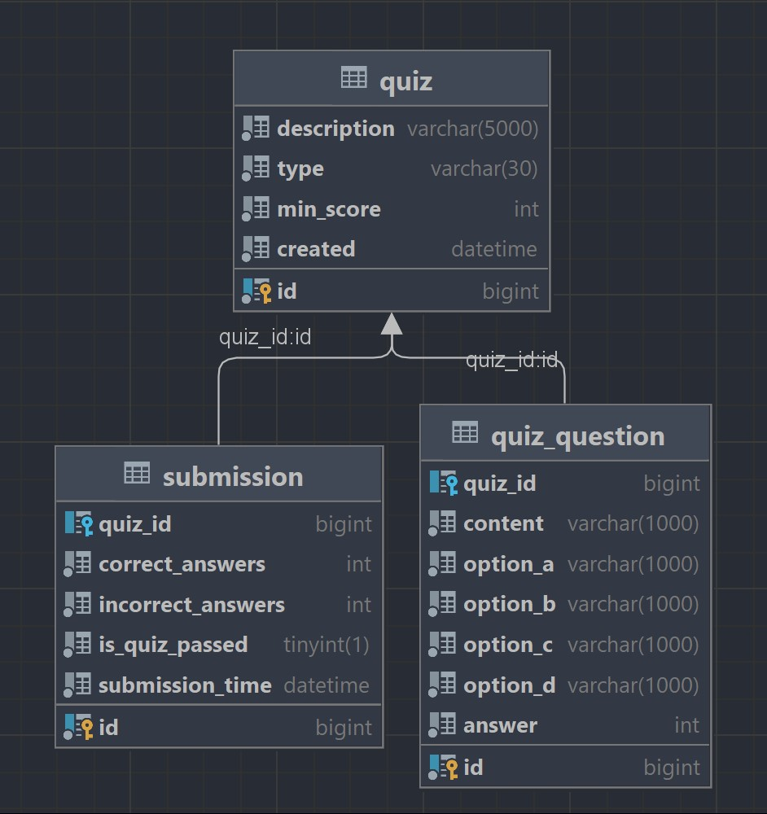

# Quizzes Spring Boot Project

## Introduction

The project enables reading, submitting, and creating quizzes, as well as saving results to a real MySQL database
instance using Spring Boot. Basic validation of input data is provided during quiz creation, along with the ability to
participate in multiple quizzes and view the results.

## Technologies

List of technologies, libraries, and tools used in the project:

- Spring Boot 2.6.4
- Java 17
- Maven
- MySQL
- Spring Data JPA
- Spring Boot Starter Web
- Thymeleaf
- Spring Boot Starter Validation
- Lombok
- Springdoc OpenAPI UI 1.6.6
- Liquibase
- JUnit 5 (through Spring Boot Starter Test)
- ArchUnit 1.0.1 (form additional test scope)
- Docker

In addition to standard tests, this project includes architectural tests using the ArchUnit library to ensure adherence
to proper architectural principles. These tests verify various rules within the project's structure, such as ensuring
model classes do not access controllers, model classes do not use Spring annotations, repository and service classes are
named appropriately (ending with 'Repository' and 'Service' respectively), and controllers end with 'Controller'. They
also enforce that repositories are accessed only from services and other repositories, service classes are accessed only
by services and controllers, and controllers are accessed only by other controllers. Moreover, the tests confirm that
controllers do not access repositories directly, DTOs (Data Transfer Objects) do not contain business logic, exceptions
are named correctly, and the project is free of cyclic dependencies. Additionally, they check for the non-use of field
injection, absence of deprecated classes or methods, the avoidance of 'Impl' suffix in class names, and ensure that
interface methods are public. These architectural tests play a crucial role in maintaining the project's quality and
integrity.

## Configuration

### Requirements

- Docker (mandatory for this project)

Ensure that ports 8080 (for Spring) and 3306 (for MySQL) are free and not being used by any other processes.

### Running the Application Locally

Navigate to the root directory of the project in the terminal and use the following command:

```bash
docker-compose -f docker-compose-app-with-db.yml up -d
```

or

```bash
docker compose -f docker-compose-app-with-db.yml up -d
```

Please wait a minute for the database and Spring application to start up, it may take about a minute.

### Database Connection

To connect to the MySQL database, remember that the database is available on port 3306. The username is `root`, and the
password is `password`. Ensure that this port is open and accessible for the application to connect to the database
successfully.

## Basic User Interface

This section describes the basic user interface and the primary endpoints of the application:

1. **Home Page** - [http://localhost:8080/](http://localhost:8080/)
    - This is the main landing page of the application.

2. **View Quizzes** - [http://localhost:8080/quizzes](http://localhost:8080/quizzes)
    - This page allows for browsing quizzes with pagination.
    - Features include the ability to start a quiz, check your performance, and delete a quiz.

3. **Create Quiz** - [http://localhost:8080/quizzes/create](http://localhost:8080/quizzes/create)
    - This page is dedicated to creating a new quiz.
    - It includes validation to ensure that the quiz details are correct and complete.

## DB Schema

